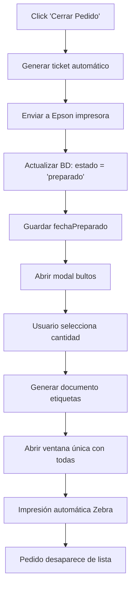

# FLUJO OPTIMIZADO DE IMPRESIÓN - EXPEDICIONES CLIENTES

## ⭐ REFORMAS COMPLETAS IMPLEMENTADAS (29/07/2025)

### 🎯 Problemas Solucionados

#### ❌ Problemas Anteriores:
- Ticket con formato pequeño y sin productos
- Etiquetas sin datos de empresa
- Pedidos no se cerraban realmente
- Flujo de impresión incompleto

#### ✅ Soluciones Implementadas:
- **Ticket reformado**: 7.5cm ancho, letra grande, productos visibles
- **Etiquetas profesionales**: 10×15cm con datos empresa completos
- **Cierre real**: Pedidos se marcan como 'preparado' en BD
- **Flujo automático**: Un clic ejecuta todo el proceso

### 📄 **NUEVO TICKET PROFESIONAL (7.5cm)**

#### Características mejoradas:
- ✅ **Ancho exacto**: 7.5cm (283px) para Epson TM-T70II
- ✅ **Tipografía grande**: 14-20px (antes 10-12px)
- ✅ **Productos visibles**: Lista completa con detalles
- ✅ **Badge de origen**: WooCommerce (amarillo) / Manual (azul)
- ✅ **Información bultos**: Destacada en recuadro
- ✅ **Comentarios**: Sección separada con marco
- ✅ **Datos empresa**: Header corporativo completo

#### Estructura del ticket:
```
┌─────────────────────────────────┐
│  [EMPRESA] - TICKET DE PEDIDO   │ ← Header corporativo
├─────────────────────────────────┤
│  Pedido Nº: 487759              │
│  Fecha: 29/07/2025              │
│  Operario: Usuario              │
│  Estado: PREPARADO              │
├─────────────────────────────────┤
│  [ORIGEN: WOOCOMMERCE/MANUAL]   │ ← Badge colorizado
├─────────────────────────────────┤
│  CLIENTE:                       │
│  Juan Pérez                     │
│  Calle Falsa 123                │
│  28001 Madrid                   │
├─────────────────────────────────┤
│  📦 PRODUCTOS PEDIDO            │
│  ┌─────────────────────────────┐ │
│  │ Jamón Ibérico               │ │
│  │ Cant: 2 piezas - 1.5kg     │ │
│  │ Lote: LT2025001             │ │
│  └─────────────────────────────┘ │
├─────────────────────────────────┤
│  📦 BULTOS: 3                   │ ← Destacado
├─────────────────────────────────┤
│  📝 COMENTARIOS (si existen)    │
└─────────────────────────────────┘
```

### 🏷️ **NUEVAS ETIQUETAS DE ENVÍO (10×15cm)**

#### Dimensiones y diseño:
- ✅ **Tamaño estándar**: 10cm × 15cm exactos
- ✅ **Header corporativo**: Logo, nombre, dirección, teléfono
- ✅ **Sección remitente**: Datos completos para devoluciones
- ✅ **Destinatario destacado**: Marco azul con información clara
- ✅ **Código de barras**: Para seguimiento y trazabilidad
- ✅ **Badge origen**: WooCommerce/Manual claramente visible

#### Estructura de etiqueta:
```
┌──────────────────────────────────────┐ 10cm
│ 📦 [EMPRESA] Tel: XXX | web.com      │
├──────────────────────────────────────┤
│        ETIQUETA DE ENVÍO             │
│     [ORIGEN: WOOCOMMERCE/MANUAL]     │
├──────────────────────────────────────┤
│      BULTO 1 DE 3                    │
│   Pedido Nº 487759                   │
├──────────────────────────────────────┤
│ 📍 DESTINATARIO:                     │
│ ┌──────────────────────────────────┐ │
│ │ Juan Pérez                       │ │
│ │ Calle Falsa 123                  │ │
│ │ 28001 Madrid                     │ │
│ │ 📞 Tel: 600123456               │ │
│ └──────────────────────────────────┘ │
├──────────────────────────────────────┤
│ 📤 REMITENTE:                        │ ← NUEVO
│ [Empresa Name]                       │
│ [Dirección Empresa]                  │
│ 📞 [Teléfono Empresa]               │
├──────────────────────────────────────┤
│     CÓDIGO DE SEGUIMIENTO            │
│   ||||| 87759001 |||||              │
├──────────────────────────────────────┤
│ 📅 29/07/2025 14:30 👤 Op: Usuario  │
└──────────────────────────────────────┘ 15cm
```

### 🔄 **FLUJO DE CIERRE CORREGIDO**

#### Nuevo proceso completo:


#### Campos actualizados en BD:
```javascript
{
  lineas: lineas,                    // Productos finales
  estado: 'preparado',               // Estado cerrado
  usuarioTramitando: usuario,        // Quien cerró
  bultos: bultos,                    // Cantidad de bultos
  fechaPreparado: new Date().toISOString()  // Timestamp
}
```

## 🎯 Flujo Correcto Implementado

#### 1️⃣ **Usuario hace clic en "Cerrar Pedido"**
```
handleCerrar() →
├── 📄 Impresión AUTOMÁTICA ticket profesional (7.5cm)
│   ├── Se crea iframe oculto
│   ├── Se genera ticket con generarTicketTexto()
│   ├── Se envía a Epson TM-T70II (impresora predeterminada)
│   └── Sin intervención del usuario
├── 💾 Actualización AUTOMÁTICA en base de datos
│   ├── estado: 'preparado'
│   ├── fechaPreparado: timestamp
│   └── usuarioTramitando: usuario
└── 🏷️ Se abre modal ModalBultos
```

#### 2️⃣ **Usuario selecciona número de bultos**
```
ModalBultos →
├── Input numérico para cantidad de bultos
├── Usuario confirma cantidad
└── Clic en "Imprimir Etiquetas"
```

#### 3️⃣ **Se genera UNA SOLA ventana con todas las etiquetas (10×15cm)**
```
handleImprimirEtiquetas() →
├── 🏷️ generarDocumentoEtiquetasCompleto(pedido, numBultos)
├── Se abre UNA ventana con TODAS las etiquetas (formato 10×15cm)
├── Separación automática por páginas (@page)
├── Datos empresa en cada etiqueta
├── Optimizado para Zebra GK420d
└── Se cierra modal automáticamente
```

### 🔧 Funciones Implementadas

#### `src/utils/ticketGenerator.js`

```javascript
// Ticket profesional para impresión automática
export function generarTicketTexto(pedido, usuario)

// Documento único con todas las etiquetas
export function generarDocumentoEtiquetasCompleto(pedido, numBultos)
```

#### `src/expediciones-clientes/ExpedicionClienteEditor.jsx`

```javascript
// Cierre automático con impresión de ticket
function handleCerrar() {
  // 1. Impresión automática via iframe oculto
  // 2. Apertura de modal de bultos
}

// Etiquetas en ventana única
const handleImprimirEtiquetas = (numBultos) => {
  // 1. Genera documento completo
  // 2. Una sola ventana para todas las etiquetas
  // 3. Cierra modal
}
```

### 📊 Ventajas del Flujo Optimizado

| Aspecto | Antes | Ahora |
|---------|--------|-------|
| **Ticket profesional** | Ventana manual | ✅ Automático (sin ventanas) |
| **Etiquetas** | N ventanas | ✅ 1 ventana única |
| **Experiencia usuario** | Múltiples clics | ✅ Flujo simplificado |
| **Gestión ventanas** | Saturación | ✅ Mínimo impacto |

### 🖨️ Configuración de Impresoras

#### **Epson TM-T70II (Ticket Profesional)**
- **Método:** iframe oculto → impresora predeterminada
- **Formato:** HTML profesional con datos completos
- **Activación:** Automática al cerrar pedido
- **Usuario:** Sin intervención necesaria

#### **Zebra GK420d (Etiquetas de Envío)**
- **Método:** Ventana única con document completo
- **Formato:** HTML optimizado con separación de páginas
- **Activación:** Manual tras seleccionar bultos
- **Usuario:** Selecciona cantidad y confirma

### 🔄 Flujo de Usuario Final

```
[Cerrar Pedido] 
       ↓
📄 Ticket → Epson (AUTOMÁTICO)
       ↓
[Modal Bultos aparece]
       ↓
[Usuario selecciona cantidad]
       ↓
[Imprimir Etiquetas]
       ↓
🏷️ UNA ventana → Zebra
       ↓
[Modal se cierra automáticamente]
```

### ✅ Estado: IMPLEMENTADO Y OPTIMIZADO

El sistema ahora funciona exactamente como se solicitó:
- **Ticket profesional:** Impresión automática sin ventanas
- **Etiquetas de envío:** Una sola ventana independientemente de la cantidad
- **Experiencia optimizada:** Mínima intervención del usuario
